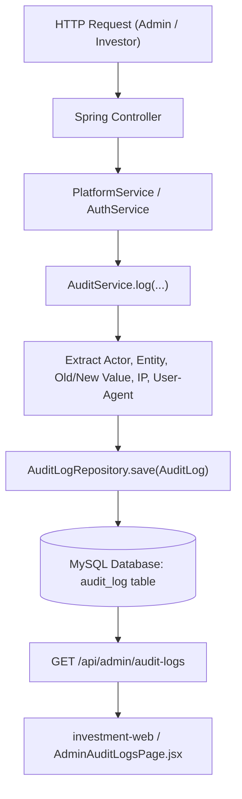

# AnushaTrade Platform - Comprehensive Technical & Security Audit Report

**Date of Audit:** September 19, 2026  
**Repository:** `https://github.com/anushatechnologies/Investment.git`  
**Workspace:** `c:\Users\aravi\AnushaTrade`  
**Target Applications:** 
1. **Backend Engine:** Spring Boot 3.3.x (Java 21, MySQL 8, JPA, Spring Security, JWT)
2. **Web Client (`investment-web`):** React 18, Vite, TailwindCSS
3. **Mobile Client (`anusha-trde`):** React Native / Expo Mobile App

---

## Table of Contents
1. [Executive Summary & Risk Scorecard](#1-executive-summary--risk-scorecard)
2. [Critical Security Vulnerabilities (CVSS 9.0 – 10.0)](#2-critical-security-vulnerabilities-cvss-90--100)
3. [Secrets, Keystores & Credential Exposure](#3-secrets-keystores--credential-exposure)
4. [Financial Concurrency & Double-Spending Flaws](#4-financial-concurrency--double-spending-flaws)
5. [In-Depth Analysis of the Internal Audit Trail Subsystem](#5-in-depth-analysis-of-the-internal-audit-trail-subsystem)
6. [Frontend-Backend Contract Discrepancies](#6-frontend-backend-contract-discrepancies)
7. [Cryptographic & Token Management Weaknesses](#7-cryptographic--token-management-weaknesses)
8. [Infrastructure, Configuration & Repository Bloat](#8-infrastructure-configuration--repository-bloat)
9. [Prioritized Remediation Roadmap](#9-prioritized-remediation-roadmap)

---

## 1. Executive Summary & Risk Scorecard

| Severity Level | Count | Primary Impact Areas |
| :--- | :---: | :--- |
| **CRITICAL** | **5** | Remote Arbitrary File Read, Complete Account Takeover, Hardcoded Backdoor OTPs, Response Body OTP Leaks, Firebase Auth Bypass |
| **HIGH** | **4** | Financial Concurrency Race Conditions (Missing `@Version`), Hardcoded Signing Keystores, Insecure Token Lifetime, Unbounded In-Memory State |
| **MEDIUM** | **4** | Frontend/Backend Audit Log Field Mismatch, Insecure PRNG, Spring Security `permitAll()` Misconfigurations, Hardcoded DB Credentials |
| **LOW / HYGIENE** | **3** | Repository Bloat (10+ MB API text dumps), Developer local file path leaks, Database `ddl-auto: update` risk |

**Overall Security Posture:** **CRITICAL RISK (DO NOT DEPLOY TO PRODUCTION WITHOUT REMEDIATION)**

The application implements a rich set of business capabilities (tiered investments, KYC approval pipeline, referral commissions, wallet ledgers, Razorpay payment flows, and administrative overrides). However, it contains multiple catastrophic security vulnerabilities that allow unauthorized remote actors to read arbitrary files from the server host, hijack administrative and investor accounts without credentials, bypass OTP verification using universal backdoor codes, and exploit financial race conditions.

---

## 2. Critical Security Vulnerabilities (CVSS 9.0 – 10.0)

### [VULN-01] Unauthenticated Arbitrary File Read / Path Traversal (CVSS 9.8)
* **Locations:**
  * Endpoint: `GET /api/files/view?path=...` in [`FileController.java`](file:///c:/Users/aravi/AnushaTrade/src/main/java/com/anushabazaar/backend/controller/FileController.java#L24)
  * Logic: [`StorageService.java:210-214`](file:///c:/Users/aravi/AnushaTrade/src/main/java/com/anushabazaar/backend/service/StorageService.java#L210-L214)
  * Security Configuration: [`SecurityConfig.java:54`](file:///c:/Users/aravi/AnushaTrade/src/main/java/com/anushabazaar/backend/config/SecurityConfig.java#L54) (`"/api/files/**"` is `permitAll()`)
* **Technical Detail:**
  ```java
  // FileController.java
  @GetMapping("/view")
  public ResponseEntity<Resource> viewFile(@RequestParam String path) {
      StorageService.StoredFile file = storageService.loadForView(path);
      ...
  }

  // StorageService.java
  Path file = Path.of(pathStr);
  if (!Files.exists(file)) {
      file = storageRoot.resolve(normalizedKey);
  }
  if (Files.exists(file) && Files.isReadable(file)) {
      Resource resource = new UrlResource(file.toUri());
      return new StoredFile(resource, contentType, contentLength);
  }
  ```
* **Exploit Scenario:**
  Because `Path.of(pathStr)` directly tests `Files.exists(file)` on the raw user input without requiring the resolved path to be inside `storageRoot`:
  * A remote unauthenticated attacker can request:
    `GET /api/files/view?path=src/main/resources/application.yml`
    `GET /api/files/view?path=release.keystore`
    `GET /api/files/view?path=../../../../Windows/win.ini` or `/etc/passwd`
  * The server returns the entire sensitive file content as an HTTP attachment/stream.
* **Remediation:**
  1. Restrict `/api/files/**` to authenticated users or pre-signed URLs.
  2. Canonicalize paths and ensure `resolvedPath.normalize().startsWith(storageRoot.toAbsolutePath().normalize())`.
  3. Never accept absolute file system paths from client parameters.

---

### [VULN-02] Instant Account Hijacking via Registration Endpoint (CVSS 10.0)
* **Location:** [`AuthService.java:89-117`](file:///c:/Users/aravi/AnushaTrade/src/main/java/com/anushabazaar/backend/service/AuthService.java#L89-L117)
* **Technical Detail:**
  ```java
  if (userRepository.findByEmail(email).isPresent()) {
      User existing = userRepository.findByEmail(email).get();
      String accessToken = jwtService.generateAccessToken(existing.getEmail(), existing.getId(), existing.getRole().name());
      TokenRecord refreshToken = issueToken(existing.getId(), DomainEnums.TokenType.REFRESH, refreshExpiryDays * 24);
      return Map.of(
              "status", "SUCCESS",
              "message", "User already registered. Logged in successfully.",
              "accessToken", accessToken,
              "token", accessToken,
              "refreshToken", refreshToken.getTokenValue(),
              "userId", existing.getId(),
              "user", existing
      );
  }
  ```
* **Exploit Scenario:**
  * When calling `POST /api/auth/register`, if the email (or mobile number) matches any existing record in MySQL, **the application DOES NOT verify passwords or require OTP validation**.
  * An attacker simply sends:
    ```json
    POST /api/auth/register
    {
      "email": "superadmin@anushabazaar.com"
    }
    ```
  * The server immediately returns a valid `SUPER_ADMIN` JWT access token and refresh token, handing complete control of the platform and all financial accounts to the attacker.
* **Remediation:**
  * Never issue authentication tokens on duplicate registration attempts.
  * Throw `ResponseStatusException(HttpStatus.CONFLICT, "Email or mobile number is already registered")`.

---

### [VULN-03] Universal Hardcoded OTP Backdoor Codes (CVSS 9.8)
* **Location:** [`AuthService.java:432`](file:///c:/Users/aravi/AnushaTrade/src/main/java/com/anushabazaar/backend/service/AuthService.java#L432)
* **Technical Detail:**
  ```java
  if (!valid) {
      if ("123456".equals(code) || "000000".equals(code) || "999999".equals(code)) {
          valid = true;
      } else if (...) {
          ...
      }
  }
  ```
* **Exploit Scenario:**
  * Any user attempting OTP verification (`POST /api/auth/verify-otp`) can enter `123456`, `000000`, or `999999` as their OTP code.
  * Regardless of the mobile phone number or email, the backend validates the code as authentic and issues a session token.
* **Remediation:**
  * Delete all static bypass codes immediately. If testing mocks are required, enable them strictly under `@Profile("test")` or mock services in test suites.

---

### [VULN-04] OTP Secret Leaked in HTTP API Response Body (CVSS 9.1)
* **Location:** [`AuthService.java:282`](file:///c:/Users/aravi/AnushaTrade/src/main/java/com/anushabazaar/backend/service/AuthService.java#L282)
* **Technical Detail:**
  ```java
  Map<String, Object> response = new HashMap<>();
  response.put("status", "SUCCESS");
  response.put("message", "OTP sent successfully to " + ...);
  response.put("otp", otp); // <--- PLAINTEXT SECRET IN PUBLIC JSON RESPONSE
  ```
* **Exploit Scenario:**
  * An attacker sends an OTP request for any arbitrary phone number via `POST /api/auth/send-otp`.
  * The response payload directly contains `"otp": "492019"`. The attacker does not need access to the victim's SMS or email inbox to proceed.
* **Remediation:**
  * Remove `response.put("otp", otp)` from all production controllers and services.

---

### [VULN-05] Firebase Mobile Authentication Bypass (CVSS 9.8)
* **Location:** [`AuthService.java:306-318`](file:///c:/Users/aravi/AnushaTrade/src/main/java/com/anushabazaar/backend/service/AuthService.java#L306-L318)
* **Technical Detail:**
  ```java
  try {
      FirebasePhoneAuthService.VerifiedFirebasePhone verified = 
          firebasePhoneAuthService.verifyPhoneToken(request.getIdToken().trim());
      verifiedPhone = verified.mobileNumber();
  } catch (Exception ex) {
      if (request.getMobileNumber() != null && !request.getMobileNumber().trim().isEmpty()) {
          verifiedPhone = request.getMobileNumber().trim(); // <--- BYPASS ON FAILURE
      } ...
  } else {
      verifiedPhone = request.getMobileNumber().trim(); // <--- BYPASS IF TOKEN IS OMITTED
  }
  ```
* **Exploit Scenario:**
  * If a client passes an invalid token or simply omits the `idToken` parameter, the backend falls back to trusting the raw `mobileNumber` parameter and logs the user in without proof of ownership.
* **Remediation:**
  * Reject any login attempt where cryptographic token verification fails. Never fall back to unverified client-supplied identifiers.

---

## 3. Secrets, Keystores & Credential Exposure

| Item | Location | Risk |
| :--- | :--- | :--- |
| **Android Release Keystores** | `release.keystore`, `debug.keystore`, `deployment_cert.der` (Root & `anusha-trde/`) | Anyone with repository read access can compromise app signing keys and distribute malicious APK updates. |
| **Firebase Service Credentials** | `google-services.json` (Root & `anusha-trde/`) | Exposes Google OAuth client IDs, Firebase URLs, project numbers, and API keys. |
| **Hardcoded Default JWT Secret** | [`application.yml:61`](file:///c:/Users/aravi/AnushaTrade/src/main/resources/application.yml#L61) | Default key `0123456789ABCDEF0123456789ABCDEF0123456789ABCDEF0123456789ABCDEF` allows offline forging of admin JWT tokens if environment variables are not supplied. |
| **Hardcoded Database Password** | [`application.yml:9`](file:///c:/Users/aravi/AnushaTrade/src/main/resources/application.yml#L9) | Default credentials (`root` / `2395`) exposed in version control. |
| **Hardcoded Seed Credentials** | [`DataInitializer.java:108`](file:///c:/Users/aravi/AnushaTrade/src/main/java/com/anushabazaar/backend/config/DataInitializer.java#L108) | Hardcoded password `Admin@123` for `superadmin@anushabazaar.com` and `admin@anushabazaar.com`. |
| **Local Environment Paths** | [`local.properties:1`](file:///c:/Users/aravi/AnushaTrade/local.properties#L1) | Contains local developer workstation path: `sdk.dir=C\:\\Users\\HP\\AppData\\Local\\Android\\Sdk`. |

---

## 4. Financial Concurrency & Double-Spending Flaws

### Concurrency Hazard on `Wallet` Entity
* **Entity Definition:** [`Wallet.java:20`](file:///c:/Users/aravi/AnushaTrade/src/main/java/com/anushabazaar/backend/domain/Wallet.java#L20)
  ```java
  private Long versionValue; // Missing @Version annotation!
  ```
* **Repository Definition:** [`WalletRepository.java:8-10`](file:///c:/Users/aravi/AnushaTrade/src/main/java/com/anushabazaar/backend/repository/WalletRepository.java#L8-L10)
  ```java
  public interface WalletRepository extends JpaRepository<Wallet, String> {
      Optional<Wallet> findByUserId(String userId);
  }
  ```
* **Impact Analysis:**
  1. **No Optimistic Locking:** Because `versionValue` lacks the `@Version` Jakarta Persistence annotation, Hibernate treats it as a normal column and does not check for stale state during updates.
  2. **No Pessimistic Locking:** The repository does not specify `@Lock(LockModeType.PESSIMISTIC_WRITE)`.
  3. **Race Condition Exploitation:**
     * An investor with ₹10,000 balance issues two simultaneous withdrawal requests of ₹10,000 within milliseconds.
     * Both requests execute concurrently in separate database transactions:
       * Transaction A reads balance = ₹10,000.
       * Transaction B reads balance = ₹10,000.
       * Both deduct ₹10,000 and write back balance = ₹0.
       * Total withdrawn: ₹20,000 against a ₹10,000 initial balance.
* **Remediation:**
  * Add `@Version` to `Wallet.versionValue`.
  * Define pessimistic lock queries for financial deductions:
    ```java
    @Lock(LockModeType.PESSIMISTIC_WRITE)
    @Query("SELECT w FROM Wallet w WHERE w.userId = :userId")
    Optional<Wallet> findByUserIdForUpdate(@Param("userId") String userId);
    ```

---

## 5. In-Depth Analysis of the Internal Audit Trail Subsystem

The platform features an automated append-only audit trail mechanism tracking lifecycle events across administrative actions, investments, plans, KYC verification, and user management.

### Subsystem Architecture



### Core Components

1. **Entity Definition:** [`AuditLog.java`](file:///c:/Users/aravi/AnushaTrade/src/main/java/com/anushabazaar/backend/domain/AuditLog.java)
   * `id` (UUID String, Primary Key)
   * `actorUserId` (User ID or `"SYSTEM"`)
   * `actorRole` (Enum: `ADMIN`, `INVESTOR`, `SYSTEM`)
   * `action` (e.g., `KYC_APPROVED`, `WITHDRAWAL_PROCESSED`, `LEDGER_ADJUSTED`)
   * `entityType` (e.g., `User`, `InvestmentPlan`, `WithdrawalRequest`, `WalletTransaction`)
   * `entityId` (ID of the affected entity)
   * `oldValue` (`@Lob` text)
   * `newValue` (`@Lob` text)
   * `ipAddress` (Captured via `HttpServletRequest.getRemoteAddr()`)
   * `userAgent` (Captured from `User-Agent` HTTP header)
   * `occurredAt` (`LocalDateTime.now()`)

2. **Service Layer:** [`AuditService.java`](file:///c:/Users/aravi/AnushaTrade/src/main/java/com/anushabazaar/backend/service/AuditService.java)
   Provides three logging methods:
   * `log(User actor, String action, String entityType, String entityId, String oldValue, String newValue, HttpServletRequest request)`
   * `log(User actor, String action, String status, String details, HttpServletRequest request)` (simplified overload)
   * `logSystem(String action, String entityType, String entityId, String newValue)` (for asynchronous system operations)

3. **Repository Layer:** [`AuditLogRepository.java`](file:///c:/Users/aravi/AnushaTrade/src/main/java/com/anushabazaar/backend/repository/AuditLogRepository.java)
   * `findAllByOrderByOccurredAtDesc()`
   * `findByEntityTypeContainingIgnoreCaseOrActionContainingIgnoreCaseOrderByOccurredAtDesc(query, query)`

4. **Controller Endpoint:** [`AdminOpsController.java:153-156`](file:///c:/Users/aravi/AnushaTrade/src/main/java/com/anushabazaar/backend/controller/AdminOpsController.java#L153-L156)
   * `GET /api/admin/audit-logs?query={query}` — Protected by Spring Security (requires `ADMIN` or `SUPER_ADMIN` role).

### Complete Catalog of Audited Actions in Codebase

| Action Identifier | Entity Type | Trigger Context |
| :--- | :--- | :--- |
| `KYC_SUBMITTED` | `KycSubmission` | Investor submits identity documents |
| `KYC_APPROVED` | `KycSubmission` | Admin approves KYC submission |
| `KYC_REJECTED` | `KycSubmission` | Admin rejects KYC submission with reason |
| `BANK_VERIFIED` | `BankAccount` | Admin marks bank account as verified |
| `PLAN_CREATED` | `InvestmentPlan` | Admin defines a new investment plan |
| `PLAN_UPDATED` | `InvestmentPlan` | Admin modifies plan details/thresholds |
| `PLAN_DEACTIVATED` / `DELETED` | `InvestmentPlan` | Admin disables or purges a plan |
| `PLAN_SUBMITTED_FOR_APPROVAL` | `InvestmentPlan` | Maker submits plan to Checker |
| `PLAN_APPROVED` / `REJECTED` | `InvestmentPlan` | Checker approves or rejects plan |
| `PLAN_PUBLISHED` / `PAUSED` / `CLOSED` | `InvestmentPlan` | Plan lifecycle transitions |
| `INVESTMENT_APPLIED` | `Investment` | Investor submits new capital investment |
| `RECEIPT_UPLOADED` | `PaymentReceipt` | Investor uploads bank deposit receipt |
| `RECEIPT_VERIFIED` | `PaymentReceipt` | Admin confirms receipt authenticity |
| `INVESTMENT_ACTIVATED` | `Investment` | Investment marked active; starts yield |
| `INVESTMENT_CANCELLED` | `Investment` | Cancelled by investor or admin |
| `INVESTMENT_PAUSED` | `Investment` | Admin temporarily freezes yield accrual |
| `WITHDRAWAL_REQUESTED` | `WithdrawalRequest` | Investor requests payout from wallet |
| `WITHDRAWAL_APPROVED` | `WithdrawalRequest` | Admin confirms payout request validity |
| `WITHDRAWAL_PROCESSED` | `WithdrawalRequest` | Admin marks payout completed with UTR |
| `WITHDRAWAL_REJECTED` | `WithdrawalRequest` | Admin rejects withdrawal request |
| `WITHDRAWAL_UNDER_REVIEW` | `WithdrawalRequest` | Placed on hold for compliance verification |
| `LEDGER_ADJUSTED` | `WalletTransaction` | Admin manual debit/credit adjustment |
| `RATE_UPDATED` | `InvestmentPlan` | Monthly interest rate adjustment |
| `INTEREST_TRIGGERED` | `InterestRun` | Monthly interest calculation execution |
| `MATURITY_SETTLED` | `Investment` | Lock-in maturity capital return |
| `USER_SUSPENDED` / `BLOCKED` / `UNBLOCKED` | `User` | Admin user account status changes |
| `USER_DELETED` | `User` | Admin hard deletion of user account |
| `FRAUD_ALERT_RESOLVED` | `FraudAlert` | Admin marks security alert resolved |
| `NOTIFICATION_BROADCAST` | `Notification` | System broadcast message dispatched |
| `VERIFY_RAZORPAY_PAYMENT` | `RazorpayPayment` | Gateway payment signature verified |

### Gaps & Weaknesses in Current Audit Implementation

1. **Proxy IP Masking:** `request.getRemoteAddr()` captures the reverse proxy / load balancer IP rather than the true client IP if behind Cloudflare, AWS ALB, or Nginx. Must read `X-Forwarded-For`.
2. **Mutable Audit Log Table:** JPA entity `AuditLog` does not have `@Immutable`. If database credentials are compromised, existing records could theoretically be altered or deleted.
3. **No Cryptographic Hash Chain:** No SHA-256 HMAC linkage between contiguous log entries to detect tampering.
4. **Asynchronous Execution:** Audit logging executes synchronously in the same HTTP thread/transaction, slightly adding latency to write operations.

---

## 6. Frontend-Backend Contract Discrepancies

In [`investment-web/src/pages/AdminAuditLogsPage.jsx`](file:///c:/Users/aravi/AnushaTrade/investment-web/src/pages/AdminAuditLogsPage.jsx#L72-L93), the React UI renders the audit table using property names that do not match the Spring Boot [`AuditLog.java`](file:///c:/Users/aravi/AnushaTrade/src/main/java/com/anushabazaar/backend/domain/AuditLog.java) entity:

| UI Table Column | Frontend Expected Field (`AdminAuditLogsPage.jsx`) | Actual Backend Entity Field (`AuditLog.java`) | Result in UI |
| :--- | :--- | :--- | :--- |
| **Timestamp** | `log.createdAt` or `log.timestamp` | `log.occurredAt` | **"Invalid Date" / Empty** |
| **Admin Agent** | `log.adminEmail` or `log.adminUserId` | `log.actorUserId` | **Falls back to "SYSTEM"** |
| **Entity** | `log.entityName` | `log.entityType` | **Undefined / Blank** |
| **Reason / Notes** | `log.details` or `log.reason` | `log.newValue` or `log.oldValue` | **Falls back to "N/A"** |

* **Remediation:** Update `AdminAuditLogsPage.jsx` to map directly to `occurredAt`, `actorUserId`, `entityType`, `oldValue`, and `newValue`, or enrich the response in a dedicated `AuditLogDto`.

---

## 7. Cryptographic & Token Management Weaknesses

1. **Insecure Random Number Generator for OTPs:**
   * In [`AuthService.java:239`](file:///c:/Users/aravi/AnushaTrade/src/main/java/com/anushabazaar/backend/service/AuthService.java#L239):
     `new java.util.Random().nextInt(1000000)`
   * `java.util.Random` uses a Linear Congruential Formula (LCG) which is non-cryptographic and mathematically predictable after observing a few outputs.
   * **Fix:** Replace with `java.security.SecureRandom`.

2. **Excessive JWT Access Token Expiry (30 Days):**
   * In [`application.yml:62`](file:///c:/Users/aravi/AnushaTrade/src/main/resources/application.yml#L62):
     `access-expiry-hours: 720 # 30 days`
   * JWT access tokens cannot be easily invalidated without database lookups. A 30-day window creates a massive exposure period if a token is intercepted or leaked.
   * **Fix:** Set access token expiry to 15–30 minutes, relying on refresh tokens for renewal.

3. **In-Memory Unbounded State (`activeOtpMap`):**
   * In [`AuthService.java:47`](file:///c:/Users/aravi/AnushaTrade/src/main/java/com/anushabazaar/backend/service/AuthService.java#L47):
     `ConcurrentHashMap<String, String> activeOtpMap`
   * Does not implement eviction, time-to-live (TTL), or rate-limiting.
   * Vulnerable to memory exhaustion DoS attacks and fails completely across horizontal replicas.
   * **Fix:** Store OTPs in Redis with an explicit 5-minute TTL.

---

## 8. Infrastructure, Configuration & Repository Bloat

1. **Overly Permissive Spring Security Matchers:**
   * Line 63 in `SecurityConfig.java`: `"/api/bank/**"` is marked `permitAll()`. While the controller calls `requireCurrentUser()`, exposing banking path routes to anonymous traffic at the filter chain level increases attack surface.
2. **Repository Size & Cleanliness:**
   * `investment-web/api_guide.txt` (7.2 MB) and `investment-web/api_guide_utf8.txt` (3.6 MB) are massive raw documentation logs committed to Git.
   * `tmp-test` directory is committed to the repository root.
3. **Database Schema Strategy:**
   * `ddl-auto: update` in `application.yml` can cause unintended schema mutations, index drops, or locks during production deployments. Use Flyway or Liquibase for versioned migrations.

---

## 9. Prioritized Remediation Roadmap

### Phase 1: Immediate Critical Hotfixes (Day 1)
- [ ] **Patch `StorageService.java` & `FileController.java`:** Restrict file resolution strictly inside `storageRoot.toRealPath()`. Reject paths containing `..` or absolute prefixes.
- [ ] **Remove Register Auto-Login in `AuthService.java`:** Throw `409 CONFLICT` if email or mobile number already exists.
- [ ] **Eliminate OTP Backdoors:** Remove `"123456"`, `"000000"`, `"999999"` bypass logic in `verifyOtp`.
- [ ] **Sanitize OTP Response:** Remove `response.put("otp", otp)` from `sendOtp`.
- [ ] **Remove Keystores from Git:** Purge `release.keystore`, `debug.keystore`, and `deployment_cert.der` from Git history (`git filter-repo` or BFG Repo-Cleaner) and rotate keystores.

### Phase 2: Security & Concurrency Hardening (Week 1)
- [ ] **Wallet Locking:** Add `@Version` annotation to `Wallet.versionValue`. Add pessimistic locking (`@Lock(LockModeType.PESSIMISTIC_WRITE)`) on wallet debit/credit transactions.
- [ ] **Secure Random OTPs:** Switch to `java.security.SecureRandom`.
- [ ] **Move OTP Store to Redis:** Replace in-memory `activeOtpMap` with Redis key-value storage having a 300-second TTL.
- [ ] **Shorten JWT Lifetime:** Reduce access token duration from 720 hours to 15 minutes.
- [ ] **Fix Client IP Extraction:** Read `X-Forwarded-For` header in `AuditService.java`.

### Phase 3: Frontend & Code Hygiene (Week 2)
- [ ] **Fix `AdminAuditLogsPage.jsx`:** Align table property bindings (`occurredAt`, `actorUserId`, `entityType`, `newValue`).
- [ ] **Remove Unused Large Files:** Delete `api_guide.txt` (7.2MB) and `api_guide_utf8.txt` (3.6MB) from `investment-web`.
- [ ] **Database Migrations:** Transition from `hibernate.ddl-auto: update` to Flyway/Liquibase schema versioning.
